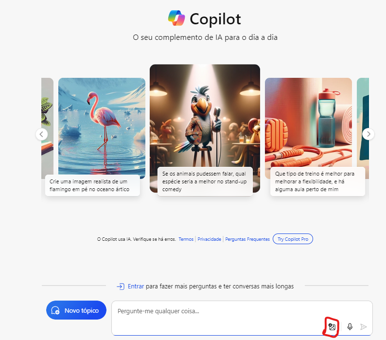
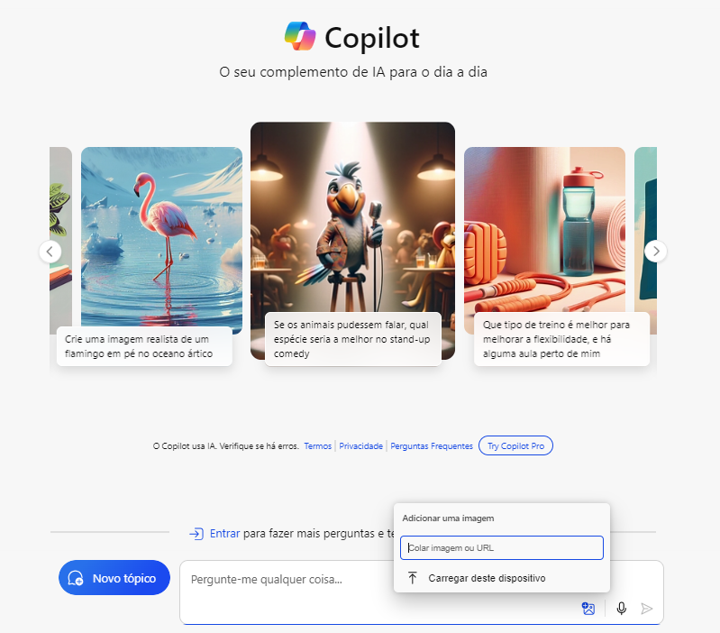
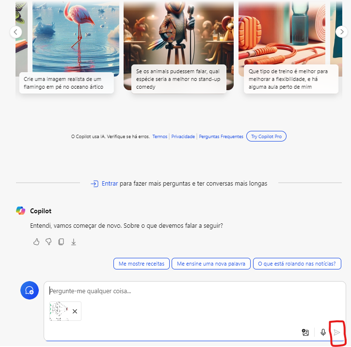
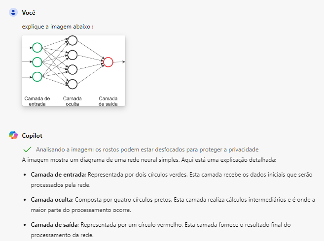

# Explorando-os-Recursos-de-IA-Generativa-com-Copilot

# 📝 Descrição do Projeto
O projeto é um desafio da **DIO** que visa explorar o uso de ferramentas de **IA Generativa**. Nesse sentido, escolhi utilizar o **Microsoft Copilot**, um assistente de inteligência artificial (IA) que se integra aos aplicativos do **Microsoft 365**. O objetivo é testar suas funcionalidades, como o reconhecimento e a explicação de imagens 📸. Além disso, o Copilot pode ajudar a automatizar tarefas, melhorar a produtividade e fornecer insights valiosos para os usuários 💡.

# ⚙ Como o projeto foi executado?
Primeiramente foi criadas duas pastas no repertório:

📁**input:** essa pasta contém as imagens que foram inseridas no Copilot para realizar os testes.

📁**output:** essa pasta tem a saída das respostas do Copilot, os resultados de cada *image* vai estar no formato **.txt**.

Após criar as pastas, foi realizado a etapa de teste com o Copilot ao qual foi notado que para realizar a consulta é bem simple.

### Passo 1: Clicar no ícone de adicionar imagem.

### Passo 2: Carregue a imagem, note que tem duas opções a primeira é para carregar uma imagem através de um link da web e a segunda opção é para fazer o upload de uma imagem de seu computador.

### Passo 3: Após adicionar a imagem desejada, no Copitot é necessário incluir um prompt de texto para habilitar o botão de envio. Em comparação, o ChatGPT, a imagem pode ser enviada diretamente, sem a necessidade de um prompt, e a resposta será gerada automaticamente.

### Passo 4: Adicione um prompt de texto e, em seguida, pressione o botão de envio, que ficará azul. Note que, ao inserir um pequeno texto, o próprio Copilot sugerirá possíveis palavras para seu prompt ao pressionar *TAB*.

### Passo 5: Aqui está o resultado da análise da imagem feito pelo Copilot.

# 💬 Feedback
O desafio foi muito interessante, pois me permitiu compreender melhor o poder das ferramentas de IA Generativa e como elas podem me ajudar no dia a dia. Além disso, tive a oportunidade de conhecer o Copilot e descobrir o quão útil ele é, mesmo já utilizando bastante o ChatGPT. O principal diferencial que notei foi que o Copilot não possui muitas limitações na quantidade de imagens que posso analisar na versão gratuita. Além disso, no momento em que testei, era possível fazer consultas sem precisar de uma conta Microsoft.
